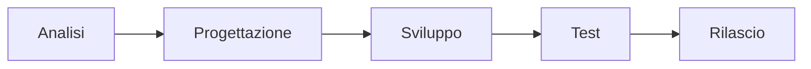
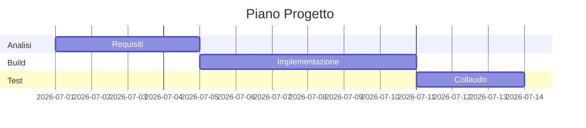
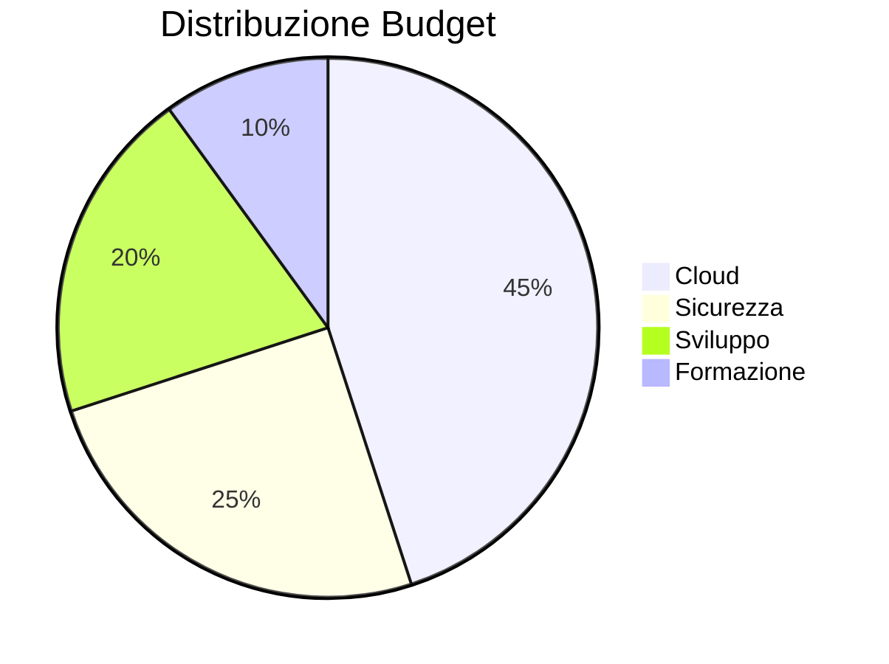

## 1. Introduzione
 
Descrizione della soluzione ad alto livello, con focus su contesto business, sistemi coinvolti e integrazioni principali.
 
# Demo Markdown Avanzato

## Panoramica
Questo documento dimostra:
- Tabelle
- Link
- Diagrammi Mermaid
- SVG inline
- Checklist
- Citazioni
- Blocchi di codice

## Tabella KPI

| Metrica | Valore | Trend |
|----------|---------:|:-----:|
| Utenti | 12.450 | 🟢 |
| Ordini | 3.287 | 🟢 |
| Ticket | 127 | 🟡 |
| Disponibilità | 99,95% | 🟢 |

## Link utili

- [Microsoft](https://www.microsoft.com)
- [GitHub](https://github.com)
- [Mermaid](https://mermaid.js.org)

## Flowchart Mermaid



## Diagramma Gantt



## Diagramma a torta



## SVG Inline

```svg
<svg width="300" height="120" xmlns="http://www.w3.org/2000/svg">
  <rect x="10" y="10" width="280" height="100" rx="12" fill="#0078D4"/>
  <circle cx="60" cy="60" r="28" fill="#50E6FF"/>
  <text x="110" y="70" font-size="24" fill="white">Demo SVG</text>
</svg>
```

## Matrice Rischi

| Rischio | Probabilità | Impatto | Priorità |
|----------|------------|----------|----------|
| Ritardi | Alta | Media | Alta |
| Bug critici | Media | Alta | Alta |
| Costi extra | Bassa | Media | Media |

## Checklist

- [x] Tabelle
- [x] Link
- [x] Mermaid
- [x] SVG
- [x] Markdown avanzato

## Blocco JSON

```json
{
  "project": "Demo",
  "version": "1.0",
  "status": "ready"
}
```

> Documento di esempio per testare renderer Markdown avanzati.
